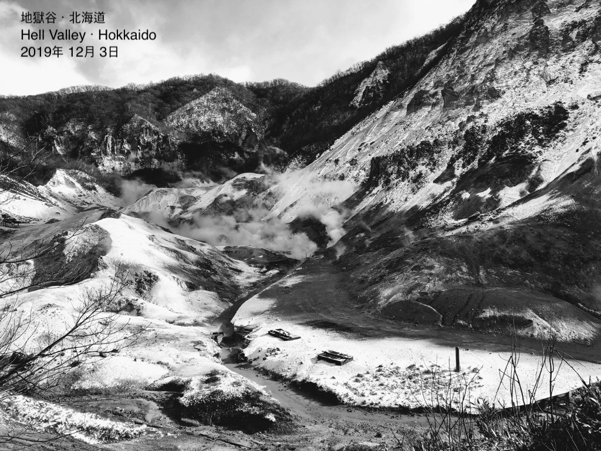

## I am a:

- world traveler
- book lover
- fic writer
- steam gamer
- humanities grad turned **software engineer**!

Change is my friend, and so is curiousity.

I love to make && re-make things.

I'm happiest when I am figuring out how things fit together - in the real world and in the shell!

<h3><em>fun fact:</em></h3>

- My favorite place I've visited so far is Hell Valley in Hokkaido.
- It's also where I took my favorite photo:

## Preferred Locations

- New York, NY
- Seattle, WA
- Seoul, South Korea
- Remote

## Current Role

- Grace Hopper Alum - Open to Work!

## Previous Roles

- Administrator - XIN Development Group International - New York, NY

  - August 2018 - December 2019

- Graduate Teaching Assistant - Cornell University, Department of Asian Studies - Ithaca, NY

  - January 2018 - June 2018

- Native English Instructor - Chungdahm Learning APRIL English Academy - Seoul, South Korea

  - August 2016 - August 2017

- Translator & Administrator - Yonsei University Korean Language Institute - Seoul, South Korea
  - September 2014 - April 2015

## Education

- Fullstack Academy - Grace Hopper Program - New York, NY

  - Full-time Web Development Immersive

- Cornell University - Ithaca, NY

  - M.A. Asian Studies

- Yonsei University - Korean Language Institute - Seoul, South Korea

  - 2-Year Korean Language Program

- University of Nebraska at Omaha - Omaha, NE

  - B.A. International Studies

## Social Media

- LinkedIn: https://www.linkedin.com/in/katherinelee703/

  - best place to contact me!

- GitHub: https://github.com/katherinelee703
  - my pinned projects are my favorites!
