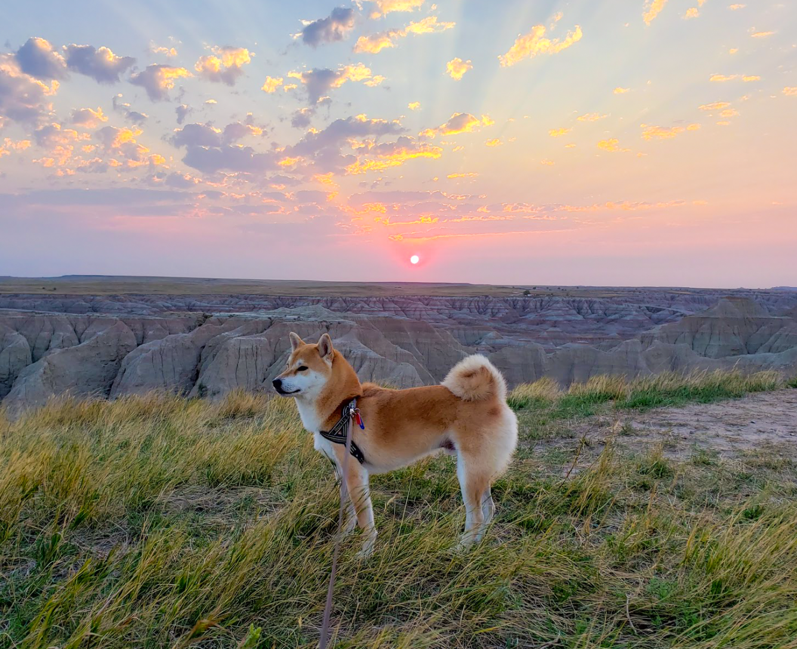

<h1></h1>
<h2>Hello, I'm Kate.</h2>

  <h3>I'm currently a software engineer at <a href="https://www.checkr.com" target=”_blank” rel="noopener noreferrer">Checkr</a>.</h3>

  

  
☆

	

  
Change is my friend, and so is curiousity.

  
<strong>I love to make, un-make, and re-make things.</strong>

  
I'm happiest when I'm figuring out how stuff fits together — in the real world and in the shell!

<h1></h1>
  
===

  <h2><em>Fun Facts:</em></h2>

  
I'm a dog mom!

  
This is Natto — he's a <a href="https://www.instagram.com/goodboynatto/" target=”_blank” rel="noopener noreferrer">very good boy</a>:

  
☆

  
The most stunning place I've visited so far is <a href="https://www.japan.travel/en/spot/1908/" target=”_blank” rel="noopener noreferrer">Hell Valley</a> in Hokkaido.

  
It's also where I took my favorite photo:

  
☆

  
My favorite phrase is from "The Girl Who Leapt Through Time":

<h1></h1>

