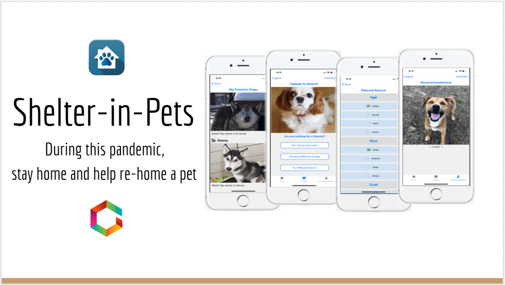

<h1></h1>

## Shelter in Pets

<h1></h1>

### Summary

During the COVID-19 pandemic, the various social distancing protocols have prevented many people from visiting shelters to adopt pets.

Our smart mobile app solves this problem by letting users search for, favorite, and connect with adoptable dogs in shelters near them from the comfort and safety of their homes.

It matches user-uploaded dog images to similar adoptable dogs, allows a user to conduct filtered searches based on desired traits, and even recommends adoptable dogs based on the user’s in-app activity.

### Tech Stack

- Client Side:

  - Expo, React Native, Redux

- Server Side:

  - Heroku, Node.js, Express, Sequelize, PostgreSQL

- REST APIs:

  - Clarifai, Petfinder, Google Maps

> <a href="https://expo.dev/@shelterinpets/ShelterInPets?release-channel=prod" target="_blank" rel="noopener noreferrer"><b>Preview the app with Expo</b></a>
>
> <a href="https://github.com/sense-5/shelter-in-pets#readme" target=”_blank” rel="noopener noreferrer">See our Github README for a visual tutorial</a>
>
> <a href="https://kate-lee-docs.s3.amazonaws.com/Shelter-In-Pets-Overview.pdf" target=”_blank” rel="noopener noreferrer">Or check out our Project Overview slides</a>

### Preview

<h1></h1>

## Cutest Coffee Clicker

<h1></h1>

### Summary

A game where all you have to do is click (or touch) the cup of coffee! It's oddly addictive...

I made this as part of a 2-day hackathon project and had a ton of fun. It is an homage to the 2013 viral hit game "Cookie Clicker."

The story goes that in a single evening in August of 2013, French web developer Julien "Orteil" Thiennot coded a simple browser-based game called <a href="https://orteil.dashnet.org/cookieclicker/" target=”_blank” rel="noopener noreferrer">Cookie Clicker</a>, hoping to direct some traffic to his personal website while also having some fun. Overnight, the game attracted some 50,000 players. Within several months it was garnering 1.5 million page views per day. What began as a one-night project — and something of a joke — is now considered to be a founding entry in the genre of <a href="https://en.wikipedia.org/wiki/Incremental_game" target=”_blank” rel="noopener noreferrer">"idle" or "incremental" games</a>, which account for a not insignificant percentage of the \$550 million in revenue generated annually by casual, mobile video games.

### Tech Stack

- Client Side:

  - JavaScript, HTML, CSS

- Serverless:

  - AWS S3, AWS Lambda

> <a href="https://0lxgcxllm9.execute-api.us-east-1.amazonaws.com/CoffeeClicker" target=”_blank” rel="noopener noreferrer"><b>You can play Cutest-Coffee-Clicker here!</b></a>

<h1></h1>

## Violet Vines

<h1></h1>

### Summary

A mock e-commerce site for boutique-style virtual bouquets.

Features include fully functional Cart, Inventory, Logged-in vs Guest vs Admin UX, and payment interface (don't worry, Stripe won't actually charge you — it's just for fun!)

### Tech Stack

- Client Side:

  - React, Redux

- Server Side:

  - Heroku, Node.js, Express, Sequelize, PostgreSQL

- REST APIs

  - Mockaroo custom JSON, Stripe

> <a href="https://violet-vines.herokuapp.com/" target="_blank" rel="noopener noreferrer"><b>Visit the website</b></a>
>
> <a href="https://github.com/2001-800080/graceshopperrepo#readme" target=”_blank” rel="noopener noreferrer">See our Github Repo</a>
>
> <a href="https://kate-lee-docs.s3.amazonaws.com/Violet-Vines-Overview.pdf" target=”_blank” rel="noopener noreferrer">Or check out our Project Overview slides</a>

### Preview

<h1></h1>

## My Bias Book

<h1></h1>

### Summary

Do you love following your favorite KPOP groups on SNS but wish there was a better way to share, organize, upvote, and comment on fan photos?

Scouring places like Reddit, Twitter, Instagram, and Discord for photos of your "bias" (favorite group member) can take ages.

My Bias Book is meant to solve this problem by providing a comprehensive space for KPOP fan photography.

This gallery-style photo submission and upvoting site helps fan photographers showcase their skills and provide great content for their fanbases.

### Tech Stack

- Client Side:

  - HTML5 Lens, SASS

- Server Side:

  - JavaScript, AWS RDS

> 
<a href="https://mybiasbook.com" target=”_blank” rel="noopener noreferrer"><b>Site currently under construction</a> — please enjoy the preview below!</b>

>
> <a href="https://github.com/mybiasbook/mbb#readme" target=”_blank” rel="noopener noreferrer">Or you can check out the GitHub Repo</a>

### Preview

<h1></h1>
